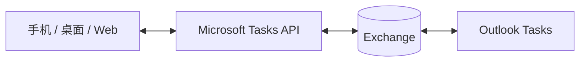

先说结论：**做出前端页面、后端接口和数据库，可以算一次全栈实践，但不足以说明一个人已经具备完整的全栈能力。**

长期以来，我发现不少人会把“写了前端页面、后端 Web Server，再做一个 TodoList”理解成全栈。这个理解不能说完全错，毕竟确实把前端、接口和数据库接了起来。但它把全栈这件事看窄了。

我理解的全栈，不是同时会写前端和后端，也不是掌握的框架越多，技术栈就越完整。真正把一个产品做出来，我们得知道它从用户点下按钮，到数据写进数据库，再到服务在线上稳定运行，中间到底经过了哪些环节。也得知道，自己在这一层做的选择，会给后面带来什么影响。

这也是我看完[《全栈工程师应该掌握哪些技能？28 个技术栈一次讲清》](https://www.bilibili.com/video/BV1jVgz6PEuQ)之后，想继续聊一聊的地方。视频（虽然是 AI 出稿、念稿子）里面把技术栈列得很完整，而我更想从一个具体产品出发，看看这些技术为什么会出现。

为了把这个差别讲清楚，本文会一直用 TodoList 做例子。从一个最小纯前端版本开始，看看它怎么一步步接近 Microsoft To Do 这样的真实产品。

整件事情拆开来看，至少要处理以下的六类问题：

1. **客户端**：用户怎么操作，页面怎么给出反馈；
2. **接口与业务**：请求怎么处理，业务规则怎么保证；
3. **数据与同步**：数据怎么保存，多台设备怎么保持一致；
4. **协作与异步任务**：任务怎么共享，提醒怎么按时执行；
5. **交付与运行**：系统怎么上线，出了问题怎么发现和恢复；
6. **架构与规模**：业务变大以后，要不要引入更复杂的技术。

最开始那个只把数据存在浏览器里的 TodoList，主要碰到的是第一层。接上 API、数据库和登录，才开始进入第二、第三层。等你继续处理跨设备同步、共享权限、提醒、部署和故障，它才慢慢接近一个真实产品。

这篇文章就顺着这个过程，看看一个 TodoList 是怎么一步步变复杂的，以及全栈工程师到底要管哪些事情。

## 客户端：先把任务交到用户手里

**先看最简单的版本。它要解决的事情很直接：用户能不能顺手地把任务记下来。**

最简单的 TodoList 可能只有一个输入框、一组任务和一个“完成”按钮。任务放在浏览器内存或本地存储里，不需要服务器，也不需要数据库。

做到这里，用到的主要是前端技术：HTML 负责页面结构，CSS 负责布局和视觉，JavaScript 或 TypeScript 负责交互逻辑，Vue、React 等框架帮我们组织组件和状态，npm、pnpm、Vite 等工具则负责依赖和构建。

不过，“页面能显示”只是起点。输入为空怎么办？不小心点了删除，能不能撤销？任务很多时，列表怎么搜索和排序？甚至考虑障碍人士能不能完成新增、编辑和删除这些基本动作？

这些都是前端要考虑到的问题：空状态、表单校验、状态管理、键盘操作和无障碍体验。它们看起来没有“页面做出来”那么显眼，但是可以决定了这个产品好不好用。

## 接口与业务：云端保存才把前后端连起来

**可一旦任务要保存到云端，事情就不只是做一个页面了，前端、服务端和数据库都得参与进来。**

比如，用户换了一台电脑，希望刚才的任务还在，而且只有自己的账户能看到。就这么一个需求，马上会带出网络、接口、登录和数据模型等一串问题。

首先，前端要把任务发给服务端。这个请求不会凭空到达：DNS 先把域名解析成服务器地址，浏览器再和服务器建立连接，通过 [TLS](https://www.cloudflare.com/learning/ssl/transport-layer-security-tls/) 加密，最后由 HTTP 请求带着任务数据到达接口。到了服务端，程序要检查请求、处理业务，再把用户、列表和任务之间的关系保存到数据库里。

平时写业务代码，我们不需要自己实现这些网络协议。但当页面突然请求失败时，至少要能判断是域名没有解析、网络连接失败、HTTPS 证书有问题，还是接口本身报错了。

这时候，一条任务也不会只有 `title` 和 `completed` 两个字段。它属于哪个用户、哪个列表，什么时候创建、什么时候更新，这些信息都可能要保存下来。

而且真正麻烦的，也不是接口能不能返回 JSON，而是每一个接口都得回答这些问题：

- 参数是否合法；
- 当前用户是否登录；
- 当前用户是否拥有这条任务；
- 同一个请求提交两次，会不会创建两条任务；
- 删除账户后，任务和列表如何处理；
- 接口失败时，前端如何识别错误并恢复。

其中，“同一个请求提交两次”并不罕见。假设用户点了一次“新增任务”，请求发出去后迟迟没有收到响应，客户端可能会再发一次。服务端要能认出这是同一个操作，否则一次点击就可能生成两条任务。工程上通常把这种“重复执行，结果仍然相同”的设计叫作幂等。

数据库也不只是会写增删改查就够了。任务少的时候，怎么查都很快；数据多了以后，同样的查询可能越来越慢，这时就要看索引和执行计划。两个请求同时修改一条任务时，又要考虑事务和锁。产品增加新字段时，还得保证数据库迁移不会破坏已有数据。

像是 GORM、TypeORM 这类 [ORM](https://aws.amazon.com/cn/what-is/object-relational-mapping/) 库可以帮我们少写一些重复代码，但这些问题最后还是会回到 SQL 和数据模型上。

登录也不是接入 [JWT](https://www.jwt.io/) 就结束了。用户怎么登录、登录状态能保持多久、退出以后旧凭证还能不能使用、服务端怎么确认请求来自这个用户，这些才是一套登录系统需要回答的问题。JWT 只是一种令牌格式，它不会自动替我们解决所有问题。

把这些做完，才只算完成了一次前端、服务端和数据库相互配合的全栈实践。

## 数据与同步：跨设备之后，保存数据还不够

**当同一份任务要出现在手机、电脑和网页上，重点就不再是“数据有没有保存”，而是“每台设备看到的是不是同一份数据”。**

到这里，Microsoft To Do 就是一个很合适的例子。按照微软的官方说明，Microsoft To Do 提供 Android、iOS、Mac、Windows 和 Web 客户端；任务通过 Microsoft Tasks API 自动同步，数据存储在 Exchange 中，并且会和 Outlook Tasks 集成。[Microsoft To Do 设置说明](https://support.microsoft.com/en-us/todo/set-up-microsoft-to-do)

从这些公开信息里，我们至少可以确认一件事：多个客户端要访问同一份云端数据，而且这份数据还要和 Outlook Tasks 关联。

光是“多个客户端访问同一份数据”，就会带来很多麻烦。用户在手机上勾选一条任务，电脑端什么时候更新？请求发出后，页面是立即显示完成，还是等服务端确认？网络坏掉了，用户能不能继续编辑？等网络恢复以后，积累下来的修改又该按什么顺序提交？

服务端也得重新考虑数据怎么同步。最直接的做法，是每次都把完整的任务列表发给客户端，这叫全量同步。数据少的时候当然没问题，可任务多了、设备多了，每次重新下载全部内容就会浪费流量和计算。

另一种做法，是客户端记住自己上次同步到哪里，下次只获取这段时间里新增、修改和删除的内容，这叫增量同步。Microsoft Graph 为 To Do 提供了 delta query，做的就是这件事。[Microsoft To Do API 概览](https://learn.microsoft.com/en-us/graph/api/resources/todo-overview?view=graph-rest-1.0)、[增量查询接口](https://learn.microsoft.com/en-us/graph/api/todotasklist-delta?view=graph-rest-1.0)

增量同步省掉了重复下载，却多出了一个问题：删除怎么同步？

假设手机和电脑里原来都有一条“交电费”。手机断网以后，你在电脑上把它删了。如果服务端直接把这条数据从数据库里彻底删掉，那么手机重新联网、询问“我离线期间有哪些任务发生了变化”时，这次响应里不会出现“交电费”。

问题在于，手机无法只凭“响应里没有这条任务”，判断它是被删除了，还是根本没有发生变化。于是，手机会继续保留本地那份旧数据。

解决办法，是让服务端暂时保留一条“交电费已删除”的记录，并把它作为一次变化同步给手机。客户端收到这条消息，才知道应该删掉本地任务。这类记录通常叫删除标记；增量接口还会给客户端一个游标，用来记住“我已经同步到这里了”。

同时修改也会遇到类似的问题。比如，手机离线时改了任务标题，电脑上又把同一条任务标记为完成。手机恢复网络后，系统是直接保留最后提交的版本，还是把标题和完成状态分别合并？如果其中一次修改被覆盖了，要不要告诉用户？

这些问题不是换一个同步框架就会自动消失。框架可以帮我们传数据，但一条删除要保留多久、两个版本发生冲突时保留哪一个，最后还是要根据业务来决定。

不过这里要说明一下：微软没有公开 Microsoft To Do 内部使用了什么数据库、缓存或者容器平台。所以，上面讨论的是根据产品功能推导出来的工程问题，不代表 Microsoft To Do 内部一定是这样实现的。

## 协作与异步：共享和提醒让事情继续变复杂

**再往前一步，当任务可以共享、分派和定时提醒时，系统要处理的就是权限和异步任务了。**

根据微软的帮助文档，Microsoft To Do 可以共享任务列表、邀请成员、停止共享，也可以把共享列表里的任务分派给成员。[共享任务列表说明](https://support.microsoft.com/en-us/todo/share-a-task-list)、[共享列表中的任务分派](https://support.microsoft.com/en-us/todo/assign-tasks-in-shared-lists)

对用户来说，界面上可能只是多了一个“分享”按钮。可对服务端来说，下面这些问题一个都绕不过去：

- 谁可以邀请成员；
- 成员能查看和修改哪些任务；
- 成员能不能删除列表或移除其他人；
- 创建者停止共享后，那些已经打开页面的成员还能不能提交修改；
- 任务被分派后，创建者和执行者各自拥有哪些权限；
- 权限变化如何同步到已经打开的页面。

这些权限的控制不仅仅停留在页面上。数据库要记住谁是列表成员、每个人拥有什么权限；服务端每次收到修改请求，也要重新检查。这样一来，一个已经被移出列表的成员，即使页面还开着，也不能继续修改里面的任务。

提醒又是另一类问题。Microsoft Graph 的 `todoTask` 数据模型中包含截止时间、提醒时间和重复规则等字段，这也说明 To Do 的任务并不只是标题和完成状态。[todoTask 数据模型](https://learn.microsoft.com/en-us/graph/api/resources/todotask?view=graph-rest-1.0)

用户设置完提醒以后，很可能就关掉网页或者退出应用了。到了时间，系统仍然要主动检查并发送通知，不能等用户再次打开页面、发来请求。

只要产品支持提醒，下面这些情况就绕不过去：

- 提醒时间按哪个时区计算，碰到夏令时切换会不会偏移；
- 重复任务完成以后，下一次任务什么时候生成；
- 提醒服务短暂不可用，恢复之后要不要补发；
- 同一个提醒因为重试执行了两次，怎么避免用户收到两条通知；
- 任务已经被删除，排队中的提醒怎么取消。

所以，提醒一般会交给一直在线的后台任务处理。任务多起来以后，还可能用到定时调度、消息队列、失败重试和去重，再把通知交给邮件、系统推送等渠道发出去。

这里我说的是“可能”，不是“一定”。产品需求只能说明系统需要异步处理，不代表它一定要上 Kafka、RabbitMQ，或者其他某个特定组件。全栈工程师要做的是判断和取舍，而不是把那些听起来牛B哄哄工具全都装进项目。

## 交付与运行：上线之后才是产品

**代码能在本地跑起来，只能算开发完成；能上线、能发现问题、出事后能恢复，才算真正交付。**

“在我电脑上能跑”不等于“这个产品可以上线”。开发环境和生产环境的操作系统、依赖版本、环境变量、数据库地址和权限，都可能不一样。

Docker 可以把应用和运行环境一起打包，减少“换一台机器就不能运行”的问题。CI/CD 可以在代码提交后自动完成测试、构建和部署，避免每次发布都依赖某个人记住一串手工步骤。

等服务真的部署到云上，还要处理域名、HTTPS、日志、备份、健康检查、灰度发布和回滚。客户端也有自己的发布周期：Web 可以跟着服务端一起更新，移动端和桌面端却可能长期停留在旧版本。

如果把交付拆开来看，至少有三件事。

第一，**服务得跑得住**。程序有没有正常响应，可以通过拨测手段健康检查来确认；流量上来以后会不会撑不住，需要提前评估容量；数据意外丢失，还得有备份和恢复方案。一次发布失败之后，团队也要知道怎么回滚。

第二，**出了问题得有人知道**。同步失败率突然升高，到底是某个客户端版本有问题，还是接口、网络或者存储出了问题？提醒没有送达，是提醒任务没有生成、待处理任务积压，还是通知渠道失败？

这些问题不能全靠猜。日志负责记录具体发生了什么，指标用来观察错误率和耗时，告警在异常出现时通知维护人员。系统再复杂一些，还可以用链路追踪把一次请求经过的多个服务串起来。

第三，**需求变了还能继续改**。新版本增加字段，旧客户端能不能忽略？接口改名以后，旧版本要兼容多久？数据库迁移失败，服务能不能退回旧版本？

除了运行和发布，安全与测试也不能等到最后再补。任务里可能写着个人安排、工作计划，甚至带有附件。微软公开说明，To Do 使用 Exchange 存储和同步数据；存到 Exchange 服务器上的数据是加密的，在应用和服务之间传输时也会加密。[Microsoft To Do 设置说明](https://support.microsoft.com/en-us/todo/set-up-microsoft-to-do)

如果换成我们自己来做，安全不能只停留在“用了 HTTPS”。比如，服务端不能让一个用户读到另一个用户的任务；分享链接不能被随便猜出来；密码和密钥不能写进代码；日志里也不应该留下用户的隐私数据。附件由谁查看、账户注销后数据怎么删除，同样要提前想清楚。

测试也不能只验证按钮能不能点击。重复任务跨过月末会怎样？夏令时切换会不会让提醒偏移？成员被移出共享列表后，已经打开的页面还能不能修改数据？旧客户端碰到新字段会不会直接崩溃？这些才是产品真正承担的风险。

> 这些对应到技术上，你大概会用到云拨测（服务是否运行）、Prometheus（指标收集、判断服务好不好）、告警、链路追踪、单元测试、集成测试、端到端测试、接口测试、压力测试和安全测试等手段。

## 架构与规模：复杂技术必须由问题驱动

**技术用得多，不代表全栈能力就强。微服务、Redis、Elasticsearch 和 Kubernetes，都是遇到具体问题之后才需要考虑的方案。**

架构一定是跟随业务需求演进的，什么时候才需要这些技术？可以先看问题有没有真的出现：

- 数据库查询开始变慢，先检查 SQL 和索引，仍然解决不了，再考虑缓存或者搜索系统；
- 大量提醒同时触发，服务来不及处理，消息队列才有机会发挥作用；
- 业务和团队已经能划分出稳定的职责，才值得讨论要不要拆成微服务；
- 容器多到很难靠人工部署和恢复时，Kubernetes 才会带来实际价值。

反过来，如果系统没有对应问题，提前引入这些技术只会增加配置、部署、网络调用和排错成本。

所以，系统设计能力不只是知道“可以用什么”，还得知道“现在不该用什么”。做技术选型，应该先看流量、数据、团队和交付周期，而不是看什么工具最近比较流行。

## 最后

回到开头：写一个页面，它是前端实践；接上 API、数据库和登录，它是一次全栈实践；能够继续处理同步、权限、异步任务、交付和规模问题，才说明你开始具备完整的全栈视角。

当然，我并不是说全栈工程师要一个人重做 Microsoft To Do，也不是说他得独自包办前端、后端、测试、安全和运维。真正重要的是，当一个需求提出来时，他能看见这件事会影响哪些地方，知道每一层在解决什么问题，也能和不同角色一起把产品做出来。

回到开头提到的视频。里面列出的编程语言、Git、Linux、网络、前端框架、服务端、数据库、Docker、消息队列、微服务、云服务和系统设计，并不是一组需要同时点亮的技能图标。说到底，它们只是出现在产品的不同阶段，分别解决不同的问题。

所以，下一次做完 TodoList，先别急着换一个新框架。继续问下去：换一台设备会怎样？多一个用户会怎样？网络断了会怎样？任务到了提醒时间，系统要做什么？上线之后，又由谁知道它出了问题？

当你开始主动考虑这些问题，才算真正从“做过前后端”走向了“具备全栈能力”。
