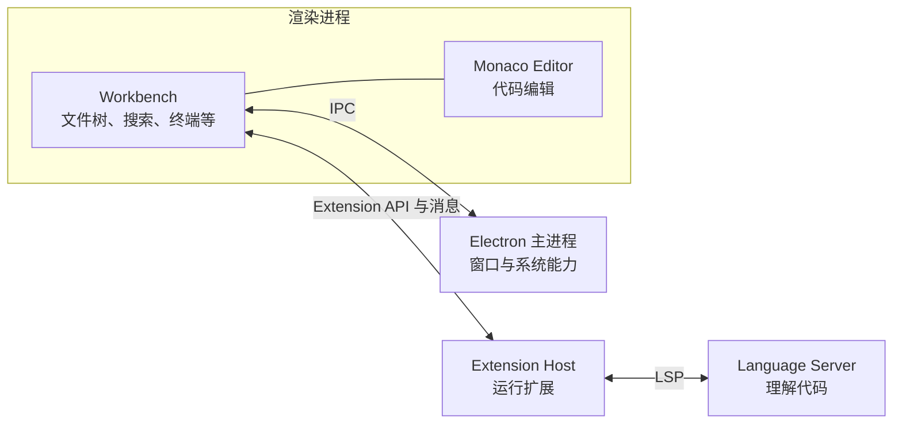
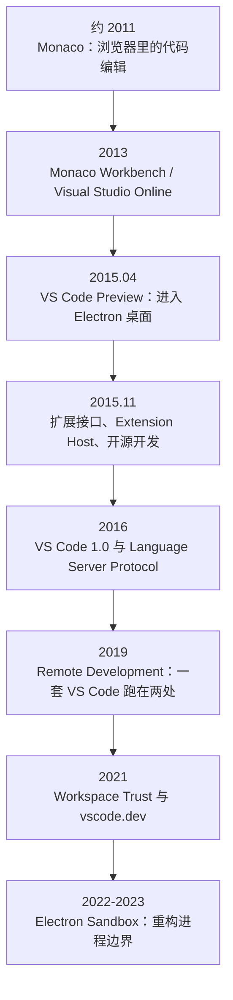
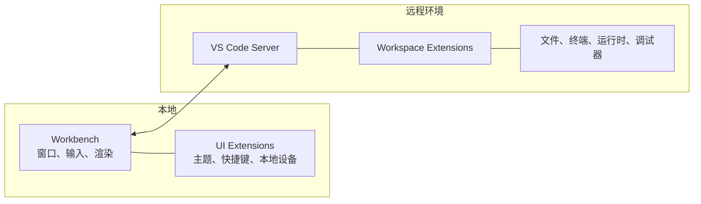

打开一个成熟项目今天的源码，很容易产生一种错觉：它的每条边界都严丝合缝，仿佛架构师在项目开始时，就已经看见了十年后的样子。

但这不是我想学的架构。

我真正想知道的是：**在决策发生的那个时间点，团队看见了什么问题？当时有哪些技术已经成熟，哪些还没有？他们尝试过什么，为什么觉得“不对”？最后做出的选择解决了什么，又留下了什么债务？**

这才是我真正想追问的 Why。

所以，这篇文章不会从今天的 `base`、`platform`、`workbench` 目录讲起。我想先把时间拉回去：从 Monaco 的浏览器实验开始，看 VS Code 怎样一步步走向桌面、扩展生态、远程开发和 Web，最后又因为 Electron 的安全变化重构进程边界。

先说结论：

> VS Code 今天的架构，不是按一张十年前画好的蓝图造出来的。它是在一次次解决现实问题的过程中长出来的。

Extension Host 最初是为了避免插件拖垮编辑器，后来却让插件可以搬到远程机器上运行。Monaco 从浏览器起步，这段经历后来支撑了 vscode.dev，也帮助 Workbench 在 Electron 沙箱改造中摆脱对 Node.js 的直接依赖。Electron 让团队迅速做出跨平台桌面产品，但多年以后，团队也不得不偿还它带来的安全债务。

只有把这些决策放回当时，今天的架构才真正有意义。

## 只看仓库历史，为什么还不够

分析架构演进，Git 提交当然重要，但它只能告诉我们“代码发生了什么”，很少直接告诉我们“团队为什么认为这件事值得做”。

VS Code 还有两个特殊情况。

第一，Code - OSS（VS Code 的开源版本）直到 2015 年 11 月发布 Beta 测试版时才开放。Monaco 更早几年的探索，没有在这个仓库里留下完整记录。第二，Remote Development 等能力横跨 VS Code 主仓库、远程扩展、服务端和产品文档。只盯着一个仓库，很容易只看到其中一部分。

因此这篇文章使用三类证据：

1. **当时的团队博客和演讲**：理解团队公开描述的问题、目标与取舍。
2. **关键版本的源码快照**：确认某种设计在当时是否真的已经落到代码里。
3. **同期技术生态资料**：理解为什么某个方案在当时可行，或者为什么后来必须改变。

这里还要特别防止一种事后归因。

如果一项 2015 年的设计在 2021 年帮助了 Web 版本，我们不能因此断言：团队早在 2015 年就预见了六年后的全部需求。我们应该分开来看：它最初解决了什么问题，后来又在哪些变化中派上了用场。

架构演进不是预言。早期选择会限制后来能走的路，也会为后来留下一些现成的路。

## 先认识几个会反复出现的角色

如果你没有读过 VS Code 源码，下面几个词很容易混在一起。我们先用一次日常使用过程把它们认清。

打开 VS Code 后，中间真正负责显示代码、处理光标和编辑文本的部分，是 **Monaco Editor**。它更像 VS Code 的编辑内核，也可以脱离 VS Code，嵌入其他网页应用。

围在编辑器周围的文件树、搜索、源代码管理、调试面板、终端、命令面板和状态栏，合在一起叫 **Workbench（工作台）**。它不是某一个具体功能，而是负责组织这些功能的应用外壳。简单说，Monaco 负责“把代码编辑好”，Workbench 负责“让你完成一整套开发工作”。

读源码时，还会碰到 **Workbench Contribution**。它和我们平时从 Marketplace 安装的扩展很容易混在一起，但两者不是一回事。

- **Workbench Contribution** 是 VS Code 内部组织功能的一种方式。搜索、调试、终端等内置能力，会把自己注册到工作台中。它主要服务 VS Code 自己的源码，并不是给 Marketplace 扩展直接使用的接口。
- **Extension** 是我们平时从 Marketplace 安装的扩展，例如某种语言、调试器或代码检查工具。它使用公开且稳定的 Extension API，不需要修改 VS Code 本身。VS Code 自带的一些语言功能，也会按照这种扩展方式实现。

大多数桌面扩展不会直接运行在界面进程里，而是交给单独的 **Extension Host（扩展宿主）**。这样，某个扩展计算太久或者发生异常时，不至于直接卡住光标和整个窗口。

语言扩展也不一定亲自完成所有语法分析。它可以把“补全、报错、跳转到定义”等请求交给独立的 **Language Server（语言服务器）**，两边用 **LSP（语言服务器协议）**通信。你可以把它理解为：VS Code 负责编辑和展示，语言服务器负责读懂代码。

后文还会提到 Electron 的 **Renderer（渲染进程）**和 **Main Process（主进程）**。前者负责窗口中的界面和交互，后者负责创建窗口、管理应用生命周期，以及调用一部分操作系统能力。先记住这些角色就够了，后面讲到具体决策时，我们再看团队为什么要移动它们之间的边界。

在桌面版中，可以先把它们的关系记成下面这样：



## 先把十年时间线摊开



如果把这十年压成一句话，大概是：

> 先证明浏览器里能做好代码编辑，再借 Electron 进入桌面；然后用 Extension Host 支撑第三方扩展，用 LSP 让语言工具可以被多个编辑器复用；最后再把这些分工延伸到远程和 Web，并为更严格的沙箱重新调整进程边界。

下面回到每一个节点。

## 第一阶段：Monaco 先问的不是“怎么做桌面开发工具”

VS Code 的起点不是 Electron，甚至不是桌面应用。

在 2016 年的 [VS Code 1.0 回顾](https://code.visualstudio.com/blogs/2016/04/14/vscode-1.0)里，团队把最初的问题写得很清楚：随着浏览器开始支持 HTML5（HyperText Markup Language 5），JavaScript 引擎也越来越快，他们想试一试，能不能在浏览器里做出一款“用起来像原生应用”的代码编辑器。

重点是代码编辑器，而不只是文本框。

它不仅要能输入文字，还要支持代码补全、错误提示和跳转到定义。操作也必须足够流畅，不能让用户处处感觉自己是在网页里写代码。后来，这个编辑器被用在 OneDrive、Bing Code Search、Azure 和 Internet Explorer 的开发者工具中，最终成为今天的 Monaco Editor。

2023 年的 [VS Code Day 官方博客](https://code.visualstudio.com/blogs/2023/04/13/vscode-day)补充了这段历史：团队先做出 Monaco Editor，又在它周围搭起内部使用的 Monaco Workbench。这个工作台后来变成嵌入 Azure 的 Visual Studio Online，最后才走向 2015 年发布的 VS Code。

团队经历也是这个时间点的一部分。官方博客提到，Erich Gamma 和 Kai Maetzel 在加入微软并创建 VS Code 之前，都参与过 IBM Eclipse。我们很容易从这种背景联想到 Eclipse 的 Workbench、插件与扩展点经验。

但这里仍然要克制：经历可以解释团队为什么熟悉这类问题，不能单独证明 VS Code 的某个机制就是从 Eclipse 复制而来。真正能确认的决策理由，仍然应该回到他们对 Monaco、扩展接口和产品目标的公开说明。

所以，VS Code 最开始问的不是：

> 如何用 Web 技术模仿桌面集成开发环境？

而是：

> 浏览器能不能成为真正的开发工具运行环境？

### 为什么当时值得试一试

团队博客提到了两个直接背景：HTML5 能力开始增长，JavaScript 运行时越来越快。

同期还有另一个重要变化：JavaScript 应用本身正在变大。TypeScript 0.8 在 2012 年出现，1.0 在 2014 年发布。TypeScript 团队当时对它的定位就是帮助开发者构建大规模 JavaScript 应用，并提到已有超过 50 万行的 TypeScript 项目。[TypeScript 1.0 发布说明](https://devblogs.microsoft.com/typescript/announcing-typescript-1-0/)

到 2015 年，TypeScript 1.5 又加入标准 ECMAScript 2015（ES6）模块、`tsconfig.json` 和更多 ES6 能力。官方发布说明甚至直接提到 VS Code、Sublime 和 Atom 已经支持 `tsconfig.json`。[TypeScript 1.5 发布说明](https://devblogs.microsoft.com/typescript/announcing-typescript-1-5/)

这不能证明 Monaco 的每个早期选择都来自 TypeScript。但它至少说明，当时已经具备了一些关键条件：浏览器不再只能承载简单页面，JavaScript 工具链也开始支持大型应用、模块化开发和编辑器集成。

### 团队自己天天用，Monaco 才从编辑器长成工作台

为了开发 Monaco Editor，团队需要一套自己每天都能用的工具。于是，他们做了一个本地 Node.js 服务，负责提供文件和编辑器界面，然后逐渐把更多开发流程放了进去。

这个动作很关键。

如果只做一个可以嵌入网页的编辑器，团队只需要关心文本模型、光标、渲染和语言能力。但当他们开始用这套工具开发 Monaco 自己时，文件、项目导航、调试和版本控制也成了绕不开的需求。

于是，Monaco 不再只是一个编辑器组件。它周围长出了我们前面说的 Workbench：一套可以承载完整开发流程的工作台。

这不是先开会画出完整架构，再照图实现。团队开始怎样使用它，直接改变了它最后长成什么样。

### 这个阶段真正做出的决策

| 维度     | 当时的选择                                 |
| -------- | ------------------------------------------ |
| 产品假设 | 浏览器可以承载接近原生体验的代码编辑       |
| 技术下注 | 以 Web 技术构建编辑器和工作台              |
| 演进方式 | 团队每天使用自己的工具，在真实需求中补能力 |
| 立即收益 | 同一编辑器可以嵌入多个 Web 产品            |
| 早期代价 | 性能、文件访问和系统能力都必须自己寻找边界 |

今天再看 VS Code 中 `editor` 与 `workbench` 的区分，就容易理解多了：先有可以独立嵌入网页的编辑器，后来才有围绕它生长的完整工作台。这是我根据产品演进做出的架构解释，并不是团队博客直接给出的结论。

## 第二阶段：2015 年选择 Electron，核心理由是复用和速度

有了 Web Workbench 以后，团队又想做一款可以安装在 Windows、macOS 和 Linux 上的本地工具。它不能只编辑云端资源，还要能处理开发者电脑上的任意代码。

按照 1.0 回顾里的说法，他们认为开发者最常用的导航、调试和 Git 工作流也应该进入产品。只把 Monaco 放进一个窗口已经不够了。

问题随之变得很具体：怎样把已有的 Web 编辑器和 Workbench 搬到桌面上？

### 为什么是 Electron

Electron 最早是 GitHub 为 Atom 开发的 Atom Shell。Electron 官方资料显示，它的第一次提交发生在 2013 年；到 VS Code Preview 发布的 2015 年，它仍然是非常年轻的桌面技术。[Electron 十周年回顾](https://www.electronjs.org/blog/10-years-of-electron)

不过，它恰好把团队需要的三样东西放在了一起：

- Chromium 提供浏览器渲染环境。
- Node.js 提供文件系统、进程和本地工具能力。
- 一套跨平台外壳负责窗口与操作系统集成。

VS Code 团队在 1.0 回顾里给出的理由很直接：既然产品已经建立在 Web 技术上，把它放进 Electron 这样的原生跨平台外壳就很自然。团队还特别提到，从这个选择到发布第一个跨平台 Preview，只用了几个月。

所以，团队在 2015 年并不是认定“Electron 就是桌面应用的终极架构”。他们做的是一个很务实的判断：

> 我们已经有一套成熟的 Web Workbench，Electron 能以最低重写成本把它带到三个桌面平台。

### 历史源码里能看到这种务实

开源后的 [`0.10.1/package.json`](https://github.com/microsoft/vscode/blob/0.10.1/package.json) 明确记录了 Electron `0.34.1`。当时的 [`electron-browser/main.ts`](https://github.com/microsoft/vscode/blob/0.10.1/src/vs/workbench/electron-browser/main.ts) 也会在负责界面渲染的 Renderer（渲染进程）中直接导入 `path`、`fs` 和 `child_process`。

按照今天的 Electron 安全要求，这种写法问题很大。但回到 2015 年，它恰恰用足了 Electron 当时最吸引人的能力：浏览器界面可以直接调用 Node.js。

这让团队快速完成产品化，也埋下了后来沙箱迁移必须偿还的债务。

我们不能因此简单地说“早期架构做错了”。如果团队一开始就为多年后的严格沙箱做准备，把所有原生调用都改成异步代理，VS Code 可能要花更长时间才能发布。更重要的是，那时产品价值还没有得到验证，团队却要先承担大量复杂度。

所以，判断这项决策是否合理，也要把发布时间和试错成本算进去。

### Electron 带来的不是一次性选择

选择 Electron，也意味着 VS Code 以后会持续受到 Chromium、Node.js 和 Electron 的影响：

- Chromium 的安全模型会影响 Renderer 能做什么。
- Node.js 版本会影响扩展和原生模块。
- Electron 的进程模型会影响窗口、Extension Host 与 IPC（Inter-Process Communication，进程间通信）。

技术栈从来不只是实现细节。一个足够底层的依赖，会用自己的升级路线反过来约束你的架构。

## 第三阶段：2015 年的两个缺口，把 VS Code 推向 Extension Host

2015 年 4 月发布的 VS Code Preview 有两个团队自己承认的根本缺口：不能充分扩展，也没有开放开发。

这两件事必须一起看。

一个编辑器如果不能扩展，团队就得亲自支持所有语言和工具；扩展接口如果经常变化，外部开发者又不敢长期投入。随便增加几个回调函数，远远不足以形成一个生态。

### 团队为什么决定“用自己的扩展接口构建自己”

VS Code 团队在 1.0 博客中解释，他们想做一套功能足够丰富、长期保持稳定的扩展 API（Application Programming Interface，应用程序编程接口）。为了验证这套 API 真的可用，他们决定让 VS Code 自己也通过它来实现重要功能。JavaScript 和 TypeScript 的核心语言服务，就是随产品一起分发的扩展。

这相当于给自己定了一条很严格的规则：

> 如果连自己的关键功能都无法通过这套 API 做出来，它就还不足以交给第三方使用。

从 Preview 到 2015 年 11 月 Beta 测试版，大约六个月。团队推出一整套扩展机制、接入 Visual Studio Marketplace，同时开源 VS Code 仓库和一批自有扩展。

到 2016 年 1.0 时，Marketplace 已经有超过 1000 个扩展。团队因此宣布 API 稳定并承诺向后兼容。

这条因果链很重要：

```text
产品无法覆盖所有语言
    ↓
必须开放扩展
    ↓
开放接口必须由真实功能验证
    ↓
核心语言能力也通过扩展实现
    ↓
API 稳定性成为长期产品承诺
```

### 为什么不让扩展直接跑在界面进程里

历史源码可以证明，Beta 阶段的扩展机制已经不只是“运行时加载一段代码”。`0.10.1` 里存在独立的 [`pluginHostProcess.ts`](https://github.com/microsoft/vscode/blob/0.10.1/src/vs/workbench/node/pluginHostProcess.ts)。它会和渲染进程建立消息通信、处理异常、监控父进程，然后启动插件宿主。

当时它还叫 Plugin Host，1.0 前后才逐渐统一成 Extension Host。

为什么要多出一个进程？因为第三方扩展可以访问 Node.js、扫描整个项目，甚至启动子进程。如果这些工作和键盘输入、光标移动、界面绘制都挤在同一个事件循环里，一个写得不好的扩展就可能卡住整个编辑器。把扩展放进单独进程，正是为了隔开开放生态与核心编辑体验。

今天的 [Extension Host 文档](https://code.visualstudio.com/api/advanced-topics/extension-host#stability-and-performance)仍然把目标概括为稳定性与性能：扩展不应拖慢启动、阻塞界面操作或直接修改界面，并且应通过激活事件（Activation Events）按需加载。

不过，Extension Host 主要解决的是故障和性能隔离，它不是一座完整的安全沙箱。扩展仍然可能读取文件、访问网络和执行程序。

### 这个选择后来又派上了用场

2015 年，团队最关心的是“别让插件拖垮编辑器”。但独立宿主还带来了一个当时不那么显眼的好处：**扩展不必和 Workbench 待在同一个进程里。**

四年后，团队真的把一部分扩展宿主搬到了远程机器上。原本为了解决插件卡顿划开的进程边界，就这样成了远程开发的现成基础。

## 第四阶段：2016 年的 LSP，让语言能力不再绑定某一个编辑器

有了 Extension API，开发者可以为 VS Code 编写语言扩展。但新的问题马上出现了。

假设有 10 种编辑器和 100 种语言。如果每种语言都要为每个编辑器单独实现补全、诊断、跳转和重构，大量工作就会被反复做一遍。

更麻烦的是，语言工具不一定用 JavaScript 编写。Java 语言服务器更适合运行在 Java 运行时里，C# 语言服务可能建立在 .NET 上。把所有语言分析逻辑都改写成 VS Code 扩展并不现实。

### 当时的团队决策

2016 年 6 月，VS Code 团队与 Red Hat、Codenvy 共同宣布 Language Server Protocol（LSP，语言服务器协议）。[官方博客](https://code.visualstudio.com/blogs/2016/06/27/common-language-protocol)划清了双方的职责：编辑器负责打开和修改文档、接收用户操作；语言服务器负责理解某一种编程语言。两边通过 JSON-RPC 交换消息，例如“用户打开了文件”“文件内容变了”“这里有哪些错误”“这个符号的定义在哪里”。

这样一来：

- 语言服务器可以使用任何编程语言实现。
- 同一个语言服务器可以服务多个编辑器。
- 编辑器不必把每种语言的分析器编译进自身。

当时，Eclipse Che 正在发展浏览器和云端开发环境，Red Hat 也准备提供独立的 Java Language Server。由此可以看出，LSP 不是 VS Code 团队关起门来做的一次内部重构。几家工具和语言团队都遇到了重复开发的问题，于是共同约定了一种通信方式。

### 为什么这比“再做一层抽象”更重要

项目内部的接口通常只服务同一套代码和运行环境。开放协议则允许两边使用不同的编程语言、运行在不同进程，甚至由不同公司分别开发。

Extension Host 解决了“第三方代码在哪里运行”，LSP 进一步解决了“语言智能如何跨工具复用”。两者组合以后，VS Code 不需要成为所有语言工具的所有者，也能提供丰富语言体验。

当然，协议也有代价。团队需要处理协议升级、消息序列化、状态同步和向后兼容。编辑器修改了一份文档，语言服务器也必须看到同一个版本；一旦两边的状态对不上，问题会比普通函数调用更难排查。

所以，不能为了“看起来解耦”就引入协议。只有当边界真的跨语言、跨进程或跨组织时，这份复杂度才值得。

## 第五阶段：2019 年 Remote，不是先想出来的，而是先被用户逼出来的

到了 2019 年，开发环境本身发生了变化。

容器、远程虚拟机和 Windows Subsystem for Linux（WSL，一套让 Windows 用户直接使用 Linux 环境的能力）越来越常见。大型代码库可能需要更强的远程机器，数据科学任务依赖本地放不下的数据和图形处理器，企业代码也可能只能保存在受控开发机中。

VS Code 团队在 [Remote Development 发布博客](https://code.visualstudio.com/blogs/2019/05/02/remote-development)里写了非常完整的决策过程。

### 他们最初并没有直接设计“分布式 VS Code”

团队一开始研究 WSL 支持时，想法比较局部：仍然用 Windows 上的 VS Code 编辑文件，再做一个脚本，让用户可以从 Bash 启动 `code`；Node.js 的远程调试则单独适配。

但很快就发现“不对”。

假设 Windows 上装的是 Python 2.7，WSL 里装的是 Python 3.7 和 Django，本地 VS Code 看到的仍然是 Windows 那套运行时、依赖和工具链。为了得到正确的代码补全和检查结果，用户不得不在两边各装一套开发环境。这恰恰违背了使用 WSL 或容器的初衷。

团队还看到其他方案各有明显损失：

- Remote Desktop 保留完整桌面，但延迟高，Linux 上也不总是容易配置。
- Secure Shell（SSH）加 Vim 足够直接，却失去现代编辑器体验。
- 本地编辑加文件同步容易慢、出错，并产生状态不一致。
- 纯浏览器工具在当时又无法完整继承用户的本地工具链和桌面体验。

团队最后得出的结论是：VS Code 必须“同时运行在两个地方”。

### 架构如何跟着问题改变

他们把窗口、键盘输入等界面工作留在本地，把文件系统、终端、调试器、语言工具和 Workspace Extension（工作区扩展）放到远程环境。主题、快捷键等 UI（User Interface，用户界面）Extension 留在本地；需要读取代码、调用远程工具链的工作区扩展，则跟着代码一起放到远端。

这不是简单地增加一条 SSH 通道。团队在博客里明确说，他们重新划分了代码边界，并开始清理一个长期存在的假设：开发环境一定就在运行界面的这台电脑上。

`1.34.0` 的 [`AbstractRemoteAgentService`](https://github.com/microsoft/vscode/blob/1.34.0/src/vs/workbench/services/remote/common/abstractRemoteAgentService.ts) 已经出现了用来识别远程端的 Remote Authority、按需建立的通信通道、WebSocket 连接和断线重连等概念。



### 为什么旧的 Extension Host 边界在这里生效了

如果第三方扩展从一开始就直接嵌在 Workbench 里，远程开发要做的就不只是移动扩展，而是重新设计整套扩展机制。

好在扩展已经通过 API 和消息与界面协作。团队现在主要需要判断“这个扩展应该在本地还是远程运行”，再把原来的进程间通信延伸到两台机器之间。

这并不表示团队在 2015 年设计 Extension Host 时，就已经计划好了 2019 年的远程开发。我们只能说：**进程边界划清以后，团队后来才有条件把其中一部分搬到另一台机器上。**

### 技术生态如何影响决策

远程开发不是凭空冒出来的产品创意。它与当时逐渐普及的容器、WSL、云端虚拟机、大型仓库和数据科学任务密切相关。

如果开发环境始终只是本机上的一个编译器和几千个文件，让 VS Code 跑在两个地方只会徒增复杂度。外部工作方式变了，这份复杂度才变得划算。

## 第六阶段：2021 年回到浏览器，但已经不是原来的 Monaco

2021 年 10 月，VS Code 团队发布 vscode.dev，并称它实现了一个酝酿十年的愿景。[vscode.dev 发布博客](https://code.visualstudio.com/blogs/2021/10/20/vscode-dev)

这看起来像回到起点，但 2021 年的 Web 版本已经不是早期 Monaco Workbench。

它背后多了几层十年前不存在的能力：

- 现代浏览器的 File System Access API 可以在用户授权后访问本地文件。
- Web Worker 可以承载一部分 Web Extension。
- GitHub Repositories 可以用虚拟文件系统打开远程仓库。
- Codespaces 可以把完整计算环境放到云端，再把 Web Workbench 接上去。
- Remote 架构已经证明界面与工作区能力可以分离。

### 团队没有假装网页版和桌面版完全一样

vscode.dev 博客很诚实地列出了能力边界：纯浏览器环境没有本地终端和调试器，也不能运行依赖 Node.js、操作系统模块或外部程序的扩展。

因此，网页版没有用一层兼容代码假装自己拥有全部桌面能力。VS Code 为不同环境提供不同的服务实现和扩展宿主，也明确告诉用户哪些事情在浏览器里做不了。

在 `1.61.0` 的 [`workbench.web.main.ts`](https://github.com/microsoft/vscode/blob/1.61.0/src/vs/workbench/workbench.web.main.ts) 里，可以看到 Web 入口先导入公共 Workbench，再为搜索、文件、凭据、更新、生命周期等服务装配浏览器实现。同一版本也已经存在 [`webWorkerExtensionHost.ts`](https://github.com/microsoft/vscode/blob/1.61.0/src/vs/workbench/services/extensions/browser/webWorkerExtensionHost.ts)。

这也解释了源码中 `common`、`browser`、`node` 这些目录名。`common` 放不依赖具体运行环境的代码，`browser` 放浏览器可用的实现，`node` 则允许使用 Node.js。它们背后的原则是：

> “负责什么”和“可以在哪里运行”必须是两个独立问题。

### 这一次，原始愿景和中途积累汇合了

说 vscode.dev 是 2011 年愿景的直接实现并不完整。

从浏览器起步的 Monaco 提供了界面和编辑器基础；Extension Host 让扩展可以换一个地方运行；Remote 把界面与计算拆开；浏览器 API 的进步又补上了本地文件访问。几条原本各自发展的路线，到 2021 年才一起组成 VS Code for the Web。

所以，这并不是一条从 2011 年直接走到 2021 年的直线。中间积累的几项能力，直到浏览器条件成熟后才真正拼到了一起。

## 第七阶段：扩展生态成功以后，安全问题开始改变核心架构

扩展和自动化能力越强，开发工具能够替用户执行的代码就越多。

运行任务、调试程序、加载项目中的代码检查工具、执行 `npm install`，都可能让刚下载的仓库在开发者机器上运行代码。VS Code 团队过去会在每个风险点分别增加提示，但他们在 2021 年的 [Workspace Trust 复盘](https://code.visualstudio.com/blogs/2021/07/06/workspace-trust)中承认，这种“发现一处、修补一处”的办法不可能解决所有问题。

于是，团队把“当前工作区是否可信”提升为 Workbench 和 Extension API 都能读取的全局状态。未信任的工作区会进入 Restricted Mode（受限模式），任务、调试等可能执行代码的能力会一起受到限制。

这件事说明，产品越成功，越可能把新的问题推入核心架构。

早期目标是让扩展“什么都能做”，后来还必须回答“什么时候允许做”。这说明，权限和信任不只是扩展系统做完后再补上的设置。扩展生态越成功，它们就越有可能成为平台本身必须理解的核心概念。

Workspace Trust 仍然不能消除恶意扩展带来的全部风险，但它至少把原本散落在任务、调试器和各个扩展里的相似判断，统一收回到了平台层。

## 第八阶段：Electron 的安全演进，迫使 VS Code 重画进程边界

Electron 最初最方便的能力之一，是 Renderer 可以直接使用 Node.js。2015 年的 VS Code 正是借此快速获得文件和进程能力。

但从安全角度看，这也意味着：一旦界面中的恶意代码突破浏览器的防线，就可能直接访问文件系统、启动进程，获得本不该拥有的系统权限。

Electron 后来逐步强化进程隔离。2022 年发布的 Electron 20 更进一步：除非显式开启 `nodeIntegration` 或关闭沙箱，Renderer 默认进入 Sandbox。[Electron 20 Release Notes](https://github.com/electron/electron/releases/tag/v20.0.0)

VS Code 没有等到最后一刻。团队在 2020 年初就开始迁移，并在 2022 年的长文 [Migrating VS Code to Process Sandboxing](https://code.visualstudio.com/blogs/2022/11/28/vscode-sandbox) 中复盘了整个过程。

### 为什么这不是改一个配置

开启沙箱后，Workbench 的渲染进程不能再直接使用 Node.js。过去由它直接完成的文件访问、进程创建和原生模块调用，都必须搬到有权限的进程里，再通过异步消息把结果传回来。

这相当于把大量本地函数调用改成跨进程协议：

```text
过去：Renderer → fs / child_process / 原生模块

后来：Renderer → 异步服务代理 → IPC → 有权限的进程
```

团队需要重新安排一批重要功能，把它们移出渲染进程：

- Extension Host（扩展宿主）
- Integrated Terminal（集成终端）
- File Watching（文件变化监听）
- Full-text Search（全文搜索）
- Task Execution（任务执行）
- Debugging（调试）

终端和文件监听被移到 Shared Process（多个窗口共用的后台进程）的子进程中。搜索、任务和调试已经有远程开发模式下的跨进程机制，可以继续复用。Extension Host 则需要一个新的运行位置：既要有完整的 Node.js，能启动子进程，又要能与沙箱中的渲染进程直接通信。

### 当 Electron 还没有合适能力时，团队改了上游

当时，Electron 没有完全满足这些要求的 API。VS Code 团队因此向 Electron 贡献了 UtilityProcess：由 Electron Main Process（主进程）创建独立的 Node.js 进程，再通过 MessagePort 和渲染进程直接通信。这样，高频消息就不必全部绕道主进程。

团队没有只在 VS Code 内部包一层代码来绕过问题，这一点更值得学习。

当基础技术栈缺少产品需要的能力时，大型团队通常有三种选择：在自己的项目里绕过去，长期维护一个私有分支，或者把缺失的能力贡献给上游。VS Code 选择了第三条路，让 Electron 本身也具备这种进程能力。

### Web 和 Remote 为什么又一次降低了迁移成本

沙箱迁移博客明确提到，VS Code for the Web 已经促使 Workbench 清理掉许多 Node.js 依赖；远程开发也已经为搜索、调试和任务建立了跨进程执行机制。

也就是说：

- Monaco 与 Web 路线让界面更接近纯浏览器模型。
- Remote 路线让原本只能在本机完成的调用，逐渐可以交给其他进程处理。
- Extension Host 路线让第三方代码本来就有独立的生命周期。

这些此前已经完成的改造，一起降低了沙箱重构的成本。

在 `1.74.0` 中，大量代码已经进入 [`electron-sandbox`](https://github.com/microsoft/vscode/tree/1.74.0/src/vs/workbench/electron-sandbox) 运行环境。对比 `0.10.1` 中直接导入 `fs` 的 Renderer，可以非常直观地看到七年间的边界变化。

### 这个阶段偿还了什么，又得到了什么

团队付出的代价是几乎遍及所有组件的异步化和进程重组，而且整个迁移从 2020 年持续到 2023 年前后。

得到的不只是更安全的渲染进程：

- Node.js 能力被收敛到更明确的进程。
- 主进程不必转发所有高频消息。
- 网页版与桌面版的实现方式进一步接近。
- 渲染进程可以在页面跳转时复用，重新加载和切换工作区也因此更快。

这次迁移原本是 Electron 安全要求推动的，最后却让 VS Code 自己的进程分工也变得更清楚。

## 今天看到的架构，是这些决策一层层叠出来的

现在再看 VS Code 的主要边界，会发现每一条都能沿时间线找到来源。

| 今天的结构                       | 最初解决的问题                          | 后来又解决了什么                                  |
| -------------------------------- | --------------------------------------- | ------------------------------------------------- |
| `editor` 与 `workbench` 分离     | Monaco 既要能嵌入网页，又要长成完整工具 | Monaco 可以独立分发，Workbench 同时支撑桌面和网页 |
| Extension Host                   | 第三方扩展不能阻塞核心界面              | 扩展可以在本地、浏览器或远程机器上运行            |
| Extension API                    | 团队无法自己覆盖所有语言与工具          | 建立 Marketplace，并长期保持扩展兼容              |
| LSP                              | 每种语言都要为每种编辑器重复实现        | 同一个语言服务器可以被多个编辑器复用              |
| 统一服务接口与远程代理           | 不同运行环境需要不同实现                | 同一界面可以连接本地、远程和浏览器环境            |
| `common/browser/node/electron-*` | 区分代码职责和它可以使用的运行时能力    | 构建时就能阻止 Node.js 代码混入 Web 和沙箱        |
| Main / Shared / Utility Process  | 拆开全局、共享和高权限工作              | 缩小故障、安全问题和性能问题的影响范围            |

所以，理解今天的 VS Code，不能只停在“它用了分层、依赖注入和多进程”。

真正值得看的，是这些结构为什么会出现：

> 它先后遇到了浏览器性能、桌面分发、扩展生态、语言复用、远程环境、Web 能力和安全模型变化。每解决一个问题，系统里就会留下一些新的分工；后来的团队再决定，这些分工是继续复用，还是重新调整。

有些分工经住了后续需求的考验，一用就是很多年；有些早期捷径后来变成债务，只能重新设计。

## 从这条演进线里，我真正学到的六件事

### 1. 判断一项架构决策，要回到它发生的那一年

2015 年让 Renderer 直接使用 Node.js，今天看并不安全，但它让团队用几个月把已有 Web Workbench 带到三个桌面平台。

后来重构成本很高，不代表早期选择必然错误。要比较的是当时的收益、当时可见的风险，以及更复杂方案会不会让产品错过验证窗口。

### 2. 好的边界不必预见未来，但能让未来少推倒一些东西

Extension Host 不是为了 Remote 才出现，Remote 却能利用它移动扩展执行位置。

架构的价值不在于准确猜中未来，而在于需求真的变化时，不必推翻整个系统。

### 3. 产品越成功，越会暴露下一批架构问题

扩展越多，兼容承诺越重，供应链和工作区执行风险也越高；远程场景越多，重连、延迟和版本一致性越重要。

架构不会因为产品成功而“完成”。成功通常只会把下一组矛盾放大。

### 4. 外部环境变了，原本不划算的复杂设计也可能变得值得

在本地开发占主流时，分布式 Workbench 可能是过度设计；当容器、WSL、云主机和大型数据集普及时，它开始解决真实痛点。

同样，File System Access API、Web Worker 和 Codespaces 的出现，让完整 Web Workbench 从愿景变成可用产品。

### 5. 依赖的基础技术，也会反过来改造你的架构

Electron 让 VS Code 快速跨平台，也通过后来的 Sandbox 规则推动 VS Code 移除 Renderer 中的 Node.js。

当产品建立在 Chromium、Node.js 和 Electron 上时，上游的安全、发布和进程模型就是自己的架构约束。大型项目不仅要升级依赖，还要参与上游。

### 6. 开放协议能让一个项目的内部能力被更多工具复用

Extension API 主要服务 VS Code 生态，LSP 则跨越编辑器、语言和组织。

当一项能力需要由不同技术栈、不同团队长期实现时，协议比项目内部的抽象更有用。不过，它也要求团队认真处理版本和兼容问题。

## 以后应该怎样分析一个开源项目的架构演进

只画当前架构图已经不够。接下来每分析一个关键决策，我会固定回答下面七个问题：

1. **当时的用户问题是什么？** 不使用后来才出现的需求解释早期选择。
2. **当时的技术生态是什么？** 哪些基础设施已经可用，哪些仍不成熟？
3. **团队试过什么？** 有没有博客、Issue 或提交记录说明某条路“不对”？
4. **真正的决策是什么？** 是重新拆模块、拆进程、制定协议，还是改变代码运行的位置？
5. **它立即解决了什么？** 不用抽象的“可扩展性”代替具体收益。
6. **它留下了什么债务？** 性能、兼容、安全和复杂度的代价，最后由谁承担？
7. **后来被怎样复用或推翻？** 区分原始目的和事后价值。

对 VS Code，还可以沿版本做一次更具体的纵向阅读：

```text
2015  0.10.1   Electron Renderer + Plugin Host
2016  1.0      稳定 Extension API + LSP
2019  1.34     Remote Agent 与远程服务代理
2021  1.61     Web Workbench + Web Worker Extension Host
2022  1.74     electron-sandbox 与新进程边界
2026  main     当前分层、运行环境与 Utility Process
```

这条阅读路径的重点不是比较文件数量，而是追踪同一项工作在不同版本里搬到了哪里：原来是谁做，后来交给了谁；原来的直接函数调用，后来为什么变成了跨进程消息。

## 最后

理解 VS Code 的架构，不能只看它今天有什么。

它从浏览器编辑器开始，借年轻的 Electron 快速进入桌面；用 Extension Host 和稳定 API 建立扩展生态；用 LSP 让语言工具走出 VS Code，被更多编辑器复用。等到容器、WSL 和远程计算逐渐普及，团队又把本地界面与远程工作区拆开。后来，VS Code 回到浏览器，也因为 Electron 安全要求的变化重新整理了进程边界。

这条演进线最有价值的地方，不是证明 VS Code 团队每次都做对了，而是让我们看到：他们怎样根据当时掌握的信息和技术条件做判断，又怎样处理旧决策后来带来的问题。

所以，以后再看一个架构选择，我想先问的不会是“这种模式叫什么”，而是：

> 当时出现了什么问题，逼着系统走到这里？团队为什么愿意为此承担这份复杂度？当初划开的边界，后来帮上了忙，还是成了必须偿还的债务？

能沿着时间回答这三个问题，才算真正开始理解系统架构的 Why。
