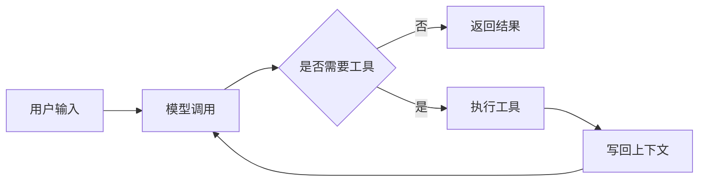
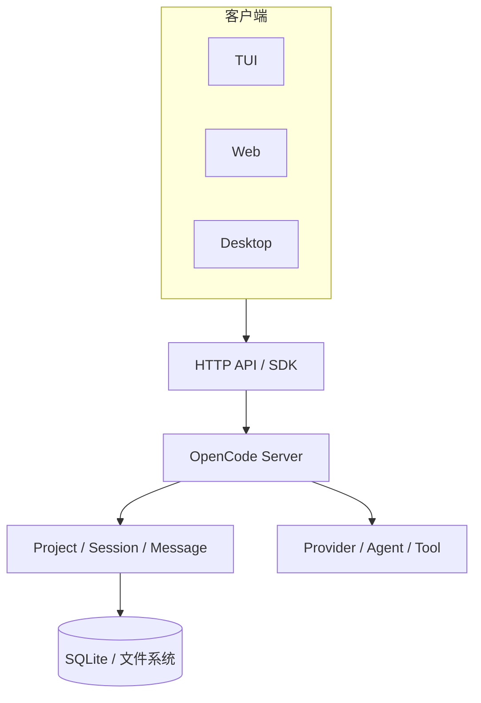
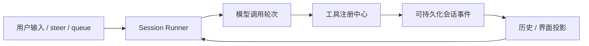

2026 年 5 月，OpenCode 在 [#25822](https://github.com/anomalyco/opencode/pull/25822) 中将 `desktop-electron` 合并回 `desktop`，并删除 Tauri 代码。此前的 [#19067](https://github.com/anomalyco/opencode/pull/19067) 已经移除 Tauri 构建任务，只发布 Electron 产物。

沿着这次迁移继续看它的仓库、PR 和 v2 设计文档，可以看到一个 Code Agent 从早期闭环走向复杂产品的一条演进线。

这件事也接上了我之前的两篇文章。[锐评桌面端技术营销：别拿跑分当工程判断](https://minorcell.top/articles/2026/desktop-tech-hype-benchmarks-vs-engineering-judgment)讨论技术选型与真实工程约束，[从 VS Code 学系统架构](https://minorcell.top/articles/2026/learning-system-architecture-from-vscode)讨论成熟系统在长期业务变化中的架构演进。

这篇文章主要表达两个观点：

1. **架构是一个持续演进的过程。** 每个阶段先解决当时最重要的问题，等新的业务边界出现，原有架构的局限才会暴露。
2. **架构的变化必然与业务绑定。** 当业务需求越来越复杂，开始涉及更多客户端、项目、运行时和可靠性要求，原有架构的维护成本会不断上升，系统才需要调整边界或者升级架构。

OpenCode 很适合用来观察这个过程。它从一个围绕 Agent loop 工作的程序，逐步演进为同时承载 TUI、Web、Desktop、远程服务、插件和多项目会话的系统。Tauri 到 Electron 是其中一次架构调整，v2 则继续处理更深的领域边界。

## 本文中的 v0、v1 和 v2

本文用 v0、v1 和 v2 表示三个架构阶段。这个划分来自我对 OpenCode 公开仓库、PR 和设计文档的整理，不对应它的公开版本号。

截至本文发布，OpenCode 最新的正式 release 是 [`v1.18.4`](https://github.com/anomalyco/opencode/releases/tag/v1.18.4)，仓库里还有一条持续演进的 [`v2` 分支](https://github.com/anomalyco/opencode/tree/v2)。这里用 v2 指代这条架构重构线，不代表已经发布了 v2.0。

| 阶段 | 主要问题                               | 架构关注点                                    |
| ---- | -------------------------------------- | --------------------------------------------- |
| v0   | Agent 能不能真正工作                   | 把模型调用、工具执行和循环闭环跑通            |
| v1   | 怎样把它做成别人每天使用的产品         | 多客户端、项目/会话、服务端 API 和桌面交付    |
| v2   | 系统怎样继续承载更多项目、插件和运行时 | Session、Location、工具注册、协议和客户端边界 |

这三个阶段对应着业务范围的持续扩大。产品每承担一类新问题，原有边界都会承受新的压力，架构也随之演进。

## v0：先把 Agent 闭环做出来

一个 Agent 最早需要的东西其实不多：接收输入，调用模型，判断模型是否要使用工具，执行工具，把结果写回上下文，再继续下一轮。



本文把 OpenCode 早期以 CLI 为主要入口、围绕 Agent loop 快速验证的形态称作 v0。这个阶段需要回答的问题很集中：Code Agent 能否解决真实问题。

因此，主流程需要足够短，方便团队快速回答几个产品问题：

- 模型能不能稳定调用？
- 工具是否真的能帮助模型完成任务？
- 用户愿不愿意把真实工作交给它？
- 一轮执行失败以后，系统还能不能继续？

为了快速验证，配置、模型适配、工具执行、会话状态和终端交互可以集中在同一个程序里。这种架构缩短了开发和反馈路径，适合业务还在寻找产品形态的阶段。

v0 的工程目标可以简单说成：先让它跑起来（**make it run**）。先把模型调用、工具执行、上下文回流和终端交互跑通，拿到真实反馈。业务形态还没有确定时，提前为 Web、Desktop、多项目和插件设计完整架构，会把尚未发生的复杂度变成当前的开发成本。

因此，集中式结构服务于验证阶段。等 Web、Desktop、多项目等真实需求出现，再根据它重新组织状态、模块和运行时，这也是架构演进的一部分。

当同一套能力开始被多个客户端使用，并需要共享项目、会话和执行状态时，早期集中式结构开始产生维护压力。Session 状态由谁拥有、工具如何调用、服务端如何与 CLI 启动逻辑协作，都还没有形成明确边界。v0 解决了产品验证问题，新的业务需求则推动系统进入 v1。

我在 [Memo Code](https://github.com/minorcell/memo-code) 上也经历过一轮缩小版的演进。最早，我通过[一篇关于 Agent ReAct 与 Loop 的文章](https://minorcell.top/articles/2025/27_react_loop)把 Agent 理解成 `tool_call → tool_result → loop`。后来开始做 Memo Code，我先选择 CLI/TUI，并在[为什么 Memo Code 先做 CLI：以及终端输入框到底有多难搞](https://minorcell.top/articles/2026/why-memo-code-cli-first-and-the-terminal-input-challenge)里记录终端输入、粘贴和光标处理这些问题。

TUI Agent 跑通以后，我尝试把同一套能力扩展到 Web 和 Desktop。这个需求很快暴露出原有架构的边界：交互、Agent 运行时、状态和事件都围绕 TUI 组织，多端共享时需要大改。我最后放弃了这次扩展。**是的，我当时的架构没做好。**

“先让它跑起来”允许暂缓多端设计，但核心运行时与 TUI 完全耦合仍然会形成债务。等多端需求真的出现，我没有及时拆开这两层，重构成本最终超过了项目能够承受的范围。

回到 OpenCode，这正是它从早期 Agent 程序进入产品化阶段时要面对的问题：同一套 Agent 能力开始被多个入口共享，Session、工具和状态需要统一组织，架构必须随业务一起调整。

## v1：从一个程序变成一套产品

进入 v1 后，OpenCode 开始服务更多入口。同一套能力需要被 TUI、Web 和 Desktop 使用，用户还要在不同项目、工作区和 Git worktree（同一仓库的独立工作目录）之间切换。会话需要持久化，文件、权限、Provider、Agent 和消息也需要被多个客户端观察和操作。

这时，系统需要一个相对稳定的服务端边界。这里的“服务端”首先是 OpenCode 在用户机器上协调客户端与 Agent 运行时的边界，重点在状态和入口如何组织。

这种转向在 2025 年 9 月合并的 [#2360](https://github.com/anomalyco/opencode/pull/2360) 中已经很明确：一个 OpenCode 进程开始支持多个实例，原来的 `app` 概念也改成了 `Project`。当前的 [project spec](https://github.com/anomalyco/opencode/blob/dev/specs/project.md) 则把 `Project`、`Session`、`Message`、文件状态、Provider、Agent 和权限组织成 API。客户端不再直接调用某个内部函数，而是围绕项目和会话与服务端交互。

从架构上看，OpenCode 由一个会调用模型的 CLI 演进成了有状态的 Agent 服务：



### 为什么要把状态放到服务端

当 TUI、Web 和 Desktop 同时存在时，状态需要由服务端统一管理。

如果 TUI、Web 和 Desktop 各自维护一套 Session 状态，系统就需要解决几个具体问题：

- 不同入口读取同一个 Session 历史。
- 工具执行和消息落库使用同一套顺序。
- 客户端重新打开时，从持久化状态恢复会话。
- 新增客户端时，继续复用已有的领域逻辑。

把 Session、Message 和工具执行放到服务端以后，客户端成为不同的观察者和交互入口。从后来形成的结构看，这个决定也为共享 Web UI、远程服务和 Desktop sidecar 留出了空间。

### Tauri 是 v1 的一个合理答案

在 v1 阶段，OpenCode 的桌面实现使用 Tauri v2。历史版本的 [desktop package](https://github.com/anomalyco/opencode/blob/v1.2.0/packages/desktop/package.json) 里可以看到 Tauri API 和插件依赖。

从实现形态看，Tauri 提供了一个相对轻的原生外壳，可以复用已有前端，同时接入文件、窗口、更新和系统能力。它满足了 OpenCode 当时的桌面交付范围，也让团队暂时不必为更完整的桌面运行时承担额外复杂度。

## 从 Tauri 到 Electron：v1 暴露出的架构压力

桌面实现进入长期维护后，OpenCode 开始并行开发 Electron 实现。在 [#25822](https://github.com/anomalyco/opencode/pull/25822) 的说明里，官方把迁移目标写得很明确：消除两套桌面实现的分叉，统一 Electron，降低维护成本。

### 先并行，再收口

2026 年 3 月合并的 [#15663](https://github.com/anomalyco/opencode/pull/15663) 增加了 `desktop-electron` 包和发布任务。此时 Tauri 还在，Electron 是另一套并行实现。

随后，Electron 版本开始建立自己的运行时边界，相关改动集中在 BrowserWindow 安全配置、IPC 和服务端进程隔离。

最后才是收口：[#19067](https://github.com/anomalyco/opencode/pull/19067) 移除了 Tauri 构建任务，只发布 Electron 产物；[#25822](https://github.com/anomalyco/opencode/pull/25822) 则把 `desktop-electron` 与原来的 `desktop` 合并，删除 Tauri 代码。

### 外壳变化背后，是进程边界变化

这次迁移同时调整了 preload、IPC、sandbox 和 utility process。[#23523](https://github.com/anomalyco/opencode/pull/23523) 为 BrowserWindow 启用 `contextIsolation` 和 `sandbox`，关闭 `nodeIntegration`；[#25962](https://github.com/anomalyco/opencode/pull/25962) 把服务端放到 utility process，拆开主进程、界面和服务端的生命周期。

Tauri 的[官方架构文档](https://v2.tauri.app/concept/architecture/)采用原生后端加系统 WebView；Electron 提供由自身版本管理的 Chromium、Node.js 和[多进程模型](https://www.electronjs.org/docs/latest/tutorial/process-model)。OpenCode 选择 Electron 后，桌面端统一使用同一套 Chromium、Node.js 和进程模型，团队可以围绕它处理 preload、IPC、安全配置和服务生命周期。这个选择通常也意味着更大的安装体积和基础运行开销，具体数值仍取决于构建方式和运行环境。

这次迁移体现了 v1 后期的业务变化：桌面端已经从“能够交付”进入“需要长期维护”的阶段。新的业务约束推动团队升级了桌面架构。

## v2：业务复杂度推动领域边界重构

OpenCode 继续处理多项目、多 worktree、子 Agent、插件、远程客户端和长时间运行的任务。原有服务端边界需要同时组织更多状态和执行生命周期，v2 相关工作因此开始重构核心对象和客户端边界。

`v2` 分支的 [`specs/v2`](https://github.com/anomalyco/opencode/tree/v2/specs/v2) 目前主要描述 Session、工具和服务生命周期。Provider、指令、协议、TUI、Desktop 等边界，分散在 `dev` 分支的独立 spec、已合并 PR 和 draft PR 中。本文把它们放在同一条 v2 演进线上，但会区分已经合并的实现和设计中的方案。

先把状态说清楚：

| 证据                                                                                                                   | 当前状态       | 本文用途                         |
| ---------------------------------------------------------------------------------------------------------------------- | -------------- | -------------------------------- |
| [#31168](https://github.com/anomalyco/opencode/pull/31168)、[#33708](https://github.com/anomalyco/opencode/pull/33708) | 已合并         | 观察已经落地的工具和协议边界     |
| [#34339](https://github.com/anomalyco/opencode/pull/34339)                                                             | Open Draft     | 观察 Session/Location 的设计方向 |
| [#31034](https://github.com/anomalyco/opencode/pull/31034)                                                             | 已关闭，未合并 | 观察 Desktop v2 的一次实验       |

### 1. 从“一个 Session”到 Location-scoped runtime

从简单的消息列表模型出发，Session 可以表达用户发消息、模型回复、工具执行和结果追加。后来，同一个服务需要管理多个项目；一个项目可能有多个目录或 worktree；Session 可以运行子 Agent；工具和权限需要绑定到具体工作区；多个客户端还会同时观察同一个会话。

这些业务场景要求 Session 区分：

- 哪些数据是全局可识别的，例如 Session 的身份和历史。
- 哪些运行时资源属于某个 Location，例如工作目录、文件系统、权限和工具注册。
- 哪个进程当前拥有这次执行，以及执行中断以后如何恢复。

在仍处于 Open Draft 的 [#34339](https://github.com/anomalyco/opencode/pull/34339) 中，团队讨论了把全局 Session 数据和 Location-scoped Session runtime 分开，并增加 runtime coordinator，让子 Agent 和不同 Location 的执行落到正确的边界里。

这个设计试图让 `Location` 从隐含的“当前目录”变成一个显式的领域对象，明确影响工具、权限、项目和执行生命周期。多项目和多 worktree 的业务需求因此开始进入领域模型。

### 2. Session 从消息列表变成可恢复的运行时

v2 的 [Session spec](https://github.com/anomalyco/opencode/blob/v2/specs/v2/session.md) 里，Session runner 需要处理模型调用、可持久化事件（durable event）、历史投影（projection）、上下文压缩（compaction）、执行中插入的指令（steer）、排队指令（queue）、执行协调和历史回放。

这背后的业务问题很具体：一次 Agent 任务可能运行很久，可能调用很多工具，可能被用户插入新的指令，也可能因为上下文过长而压缩。只把最后的文本保存下来，已经不足以支持可靠恢复。

因此，v2 的设计开始把 Session 看成一个拥有持久事件和运行时协调器的对象：



持久事件和运行时协调器的设计目标，是让系统能够应对长任务、并发输入和上下文压缩，并持续提供可回放的状态。

### 3. 工具成为受作用域管理的能力

当工具从内置能力扩展到插件能力时，注册、权限、输出和生命周期需要统一管理。

[#31168](https://github.com/anomalyco/opencode/pull/31168) 统一了应用工具和内置工具的声明、注册与结算方式：它们使用同一个、对调用方隐藏具体实现的 `Tool<Input, Output>` 承载类型，通过 `tools.register(...)` 注册；Session runner 传入持久化的调用身份；工具注册中心负责有效注册、输入输出编解码、执行结算和过期注册检查。v2 Tools spec 进一步规定，静态编写的插件工具也使用同一套声明合同；但 `#31168` 的说明仍把插件注册能力列为后续工作。

这套设计带来了几个变化：

- 工具的名字由注册位置确定。
- 工具权限可以绑定到 Session、Agent 和 Location。
- 工具被替换或卸载以后，旧的调用不会静默执行到另一个实现上。
- 输出边界和留存策略由工具注册中心统一处理，工具本身不需要知道模型上下文怎么截断。

当工具和插件需要在不同 Session、Agent 和 Location 中注册、替换和治理时，“工具”从一个执行函数演进成了 Agent 平台的扩展边界。

### 4. 协议层被单独拿出来

TUI、Web、Desktop、SDK 和远程客户端都需要访问 OpenCode。它们需要一份稳定的协议合同，服务端内部类型不能继续充当公共边界。

[#33708](https://github.com/anomalyco/opencode/pull/33708) 把 HTTP API 合同抽到了 `@opencode-ai/protocol`，并明确了这样的依赖方向：

```text
@opencode-ai/schema <- @opencode-ai/protocol <- @opencode-ai/server
```

Protocol 负责端点分组、对外数据结构（DTO）、事件联合类型和中间件服务声明；Server 保留请求处理器、数据库和 Location 服务；Core 负责领域运行时。

这条边界让客户端只依赖系统对外承诺的协议，服务端内部实现可以独立调整。

同一类变化也发生在 TUI。OpenCode 的 [`TUI package extraction spec`](https://github.com/anomalyco/opencode/blob/dev/specs/tui-package.md) 明确要求：TUI 通过 SDK 访问 OpenCode，不依赖 `packages/opencode`、`packages/cli` 或 `packages/core` 的私有实现。

### 5. Desktop v2 处理的是“一个窗口里有多少个运行时”

曾以 draft experiment 提出的 [#31034](https://github.com/anomalyco/opencode/pull/31034) 讨论了 Desktop v2 如何在一个窗口中切换多个 Server、项目和会话，并把 tabs 设计成导航记录；同时划分 server、directory、draft、notification、permission、terminal 和异步操作的所有权。这个 PR 已于 2026 年 7 月 5 日关闭，未合并。

这个实验对应的是多 Server、多项目和多会话带来的状态所有权问题，试图重新划分桌面端多个独立运行时的边界。

## 从业务变化看三次架构演进

把这些变化放回业务背景，可以看到一条清楚的演进路径：v0 验证 Code Agent 能否完成真实任务；v1 开始承载多项目、持久会话和多个客户端；v1 后期需要长期维护多平台桌面产品；v2 相关工作继续处理多 Location、长任务、插件和多个运行时。

在本文观察的几次变化中，原有架构都是在开始难以承载新业务之后才调整的。业务增加了新的对象、状态、并发关系和可靠性要求，旧边界的维护成本随之上升，团队才开始调整或者升级架构。

这让我想起许式伟在团队里经常强调的一句话：

> 架构的演进，必然是业务的演进。

架构演进需要明确的业务前提。脱离业务约束讨论框架优劣，只能得到技术名词的对比，无法解释一个项目为什么在某个时间点做出迁移。

## 技术栈服从当前的业务约束

OpenCode 在 v1 使用 Tauri，满足了当时的桌面交付范围。桌面端进入长期维护阶段后，Electron 提供了统一的 Chromium、Node.js 和进程模型，也让团队能够围绕这套运行时重新处理安全和服务生命周期。两次选择分别适用于不同的业务阶段。

技术选型需要回答几个具体问题：

- 当前业务最需要解决什么？
- 现有架构在哪些地方产生了持续维护成本？
- 新技术能够降低哪些已经发生的复杂度？
- 迁移引入的成本是否值得？

包体积、启动速度和内存占用可以成为判断依据，最终决定仍然要落回产品当前的业务约束和工程成本。

## 最后

OpenCode 从 Agent loop 出发，逐步承担项目、会话、多客户端、桌面交付、长任务和插件等现实问题。每增加一类业务，原有边界就要接受一次检验；当它开始难以承载新的业务，架构才进入下一次调整。

这也是我理解的架构演进：先让产品在真实问题上跑起来，再根据已经出现的业务边界重组状态、模块和运行时。OpenCode 从 Tauri 迁移到 Electron，只是这条演进路径中的一个具体节点。

（完）
