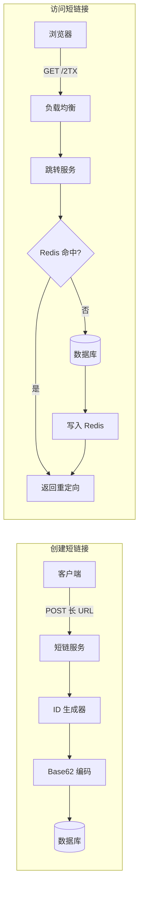

你大抵见过这样的链接：刷 X 时，一条帖子末尾挂着 `t.co/xxxx`；收到快递或活动短信时，正文里跟着一串 `t.cn/xxxx`。它们只有短短几位字符，点开后却能准确跳到一篇文章、一个商品页，或者某个长得离谱的活动地址。

这就是短链接。它看上去只是把很长的 URL（Uniform Resource Locator，统一资源定位符）变成几个字符，再在用户点击时跳回原地址，像一道简单的字符串题。

你大抵一想：这不就是把长 URL 做一次哈希（Hash），存下长短链接的映射关系，等用户访问时再返回一个 301 或 302 吗？

但真正动手以后，你会依次碰到几个绕不开的问题：

1. 哈希结果那么长，短码到底截几位？
2. 两个长链接得到同一个短码怎么办？
3. 不想每次都检查碰撞，能不能直接生成唯一短码？
4. 同一个短链被访问几万次，难道每次都查数据库？
5. 跳转应该返回 301，还是 302？
6. 数据越来越多以后，什么时候才需要分片？
7. 创建、跳转和扩容都有了，系统就能上线了吗？

这些不是七道彼此独立的题。前一个问题的答案，几乎都会把你推到下一个问题。下面就顺着这条链往下走。

## 问题一：短码到底需要几位

既然要把很长的 URL 变成短码，第一个问题就不是选什么哈希算法，而是输出要保留多少位。

先设定一个适合推演的规模：

- 每天创建 1 亿条短链接
- 平均每秒创建约 1000 条
- 每秒约有 1 万次短链访问
- 服务运行 10 年

十年需要容纳的链接数量是：

```text
100,000,000 × 365 × 10 = 365,000,000,000
```

也就是 3650 亿条。

短码通常使用数字、小写字母和大写字母，一共 62 个字符。这种表示方式叫 **Base62**。它和二进制、十六进制没有本质区别，只是每一位有 62 种可能。

| 长度 |        可表示数量 |
| ---- | ----------------: |
| 5 位 |       916,132,832 |
| 6 位 |    56,800,235,584 |
| 7 位 | 3,521,614,606,208 |

6 位只能容纳约 568 亿条，不够。7 位有 3.52 万亿种组合，可以覆盖这个假设下的十年需求。

所以“7 个字符”不是约定俗成，也不是拍脑袋定的。它是从字符集、业务规模和生命周期倒推出来的。

当然，这只是容量上限。自定义短码、保留词、删除后不复用的编码，以及随机生成造成的碰撞，都会吃掉一部分空间。但第一步始终一样：**先算容量，再决定长度。**

长度只解决了“装不装得下”。当我们把海量长 URL 塞进有限的 7 位空间，下一个问题马上就来了：两个链接拿到同一个短码怎么办？

## 问题二：截断哈希如何处理碰撞

最自然的做法，是对长 URL 做 MD5（Message-Digest Algorithm 5）哈希，再截取前 7 位作为短码。

思路听起来很自然：哈希结果足够随机，同一个输入也能稳定得到同一个输出。问题出在“截前 7 位”这件事上。

我们平时看到的 MD5 是 32 位十六进制文本，字符只有 `0-9` 和 `a-f`。如果直接截取它的前 7 位，编码空间不是 `62^7`，而是：

```text
16^7 = 268,435,456
```

只有约 2.68 亿种组合，连三天的新增量都装不下。

当然，可以先把 MD5 的 128 位结果转换成 Base62，再截取 7 位。这样字符空间回到了 `62^7`，但碰撞仍然存在：两个不同的长 URL，完全可能得到相同的 7 位前缀。

这里要区分两个概念。我们遇到的不是“有人攻破了 MD5”，而是**主动把一个很大的哈希空间压缩成了很小的短码空间**。只要持续写入，前缀重复就是正常事件。

工程上通常这样处理：

1. 给 `code` 建数据库唯一索引。
2. 插入时如果冲突，就给原始 URL 加盐后重新计算，或者重新生成随机码。
3. 限制重试次数，并记录碰撞指标。

唯一索引是最后一道防线。不能因为哈希“看起来很随机”，就把唯一性寄托在概率上。

靠判重和重试可以工作，但每创建一条短链，都要确认这个短码有没有被占用。既然碰撞来自“随机映射”，能不能从源头上直接生成一个唯一值？

## 问题三：唯一 ID 从哪里来

可以。先给每条记录分配一个整数 ID（Identifier，标识符），再把这个整数转换成 Base62。

例如，使用 `0-9a-zA-Z` 作为字符表，十进制的 `11157` 会转换成 `2TX`。

下面是完整可运行的实现。

**`base62.ts`**

```ts
const alphabet =
  '0123456789abcdefghijklmnopqrstuvwxyzABCDEFGHIJKLMNOPQRSTUVWXYZ'
const base = 62n

export function encodeBase62(input: bigint): string {
  if (input < 0n) {
    throw new RangeError('input must be non-negative')
  }

  if (input === 0n) {
    return alphabet[0]
  }

  let value = input
  let result = ''

  while (value > 0n) {
    result = alphabet[Number(value % base)] + result
    value /= base
  }

  return result
}

console.log(encodeBase62(11157n)) // 2TX
```

这个方案有三个直接优势：

- 只要整数 ID 唯一，短码就一定唯一。
- 不需要为每次创建做碰撞查询和重试。
- Base62 是可逆的，服务可以从短码还原 ID，再按主键查数据库。

但它也把问题从“短码怎么生成”转移到了“全局唯一 ID 怎么生成”。

### 小规模：数据库自增就够了

内部工具或刚上线的产品，直接用数据库自增主键最省事。数据库已经替你解决了并发分配和唯一性，不需要先造一套分布式发号器。

它的缺点也很明显：短码连续可枚举。拿到 `2TX` 的人，很容易尝试它前后的编码。如果链接不希望被顺序遍历，这个方案就不合适。

不过，不可枚举不等于访问控制。即便换成随机短码，真正的私密资源仍然需要身份认证、权限检查或带有效期的访问令牌，不能把“猜起来很难”当成安全边界。

### 规模上来后：批量分配号段

多台服务器同时创建短链时，可以让中心服务一次分配一段 ID。例如 A 节点拿到 `1-10000`，B 节点拿到 `10001-20000`。节点在本地递增，用完再申请下一段。

这样仍然保持全局唯一，但不必每创建一条短链就访问中心服务。

也可以使用 [Snowflake](https://github.com/twitter-archive/snowflake) 一类分布式 ID。不过 Snowflake 生成的是 64 位整数，完整转成 Base62 最长需要 11 位。它解决的是高并发唯一 ID，不负责让短码一定短。

这几个方案没有谁天然更高级：

| 方案               | 优点                       | 代价                         |
| ------------------ | -------------------------- | ---------------------------- |
| 自增 ID + Base62   | 简单、无碰撞、编码短       | 可枚举，依赖数据库分配 ID    |
| 随机 Base62        | 多节点天然并行，不暴露顺序 | 需要唯一索引和冲突重试       |
| 号段 + Base62      | 降低中心服务压力           | 要处理号段浪费和节点故障     |
| Snowflake + Base62 | 分布式生成成熟             | 编码更长，仍可能暴露时间信息 |

如果只是做一个团队内部短链，我会先选数据库自增。如果链接不能被枚举，就改用随机 Base62，并让唯一索引兜底。不要因为系统设计图里有 Snowflake，就默认自己也需要它。

写入侧的问题到这里基本解决了。但一条短链通常只创建一次，却可能被点击几万、几十万次。系统的主要压力，很快就从“怎么生成”转向了“怎么读取”。

## 问题四：每次跳转都要查数据库吗

短链接服务是典型的**读多写少系统**。如果每次点击都查询数据库，热门短链很快就会把读取压力集中到同一条记录上。

完整链路可以拆成两条：



读路径通常采用 Cache-Aside，也就是旁路缓存：

1. 先用短码查询 Redis。
2. 命中就直接返回目标 URL。
3. 未命中再查数据库，并把结果写回 Redis。
4. 链接被修改或删除时，让对应缓存失效。

还有一个容易漏掉的细节：**不存在的短码也要短暂缓存。**

攻击者可以不断请求随机短码。如果每次未命中都打到数据库，缓存就形同虚设。给“不存在”这个结果设置几十秒的短 TTL（Time To Live，存活时间），能挡住大量重复的无效查询。

缓存解决了“怎样更快找到原地址”，却没有回答另一个问题：浏览器下一次点击时，还要不要再次经过短链服务？这正是 301 和 302 的区别。

## 问题五：跳转应该返回 301 还是 302

301 和 302 都是 HTTP（Hypertext Transfer Protocol，超文本传输协议）重定向状态码。

短链接可以返回 301。它表示资源已经永久移动到新地址。浏览器和中间缓存可以记住这个结果，下次访问时甚至不再请求短链服务。

这确实能减轻服务压力，但也意味着你失去了一部分控制权。

| 维度         | 301 永久重定向                   | 302 临时重定向           |
| ------------ | -------------------------------- | ------------------------ |
| 浏览器缓存   | 更容易被长期缓存                 | 通常会再次请求短链服务   |
| 修改目标地址 | 已缓存的客户端可能继续访问旧地址 | 修改后更容易及时生效     |
| 点击统计     | 后续点击可能绕过服务             | 每次访问通常都会经过服务 |
| 服务压力     | 更低                             | 更高                     |

如果短链目标永远不会变，也不关心每一次点击，301 很合理。

但大多数产品型短链需要修改目标、设置过期时间、做访问统计，甚至在发现恶意地址后立即封禁。这种情况下，我会默认返回 302，并根据业务设置合适的 `Cache-Control`。如果要求每次点击都回到服务端，可以明确使用 `no-store`，而不是只依赖浏览器对 302 的默认行为。

关于状态码的标准语义，可以直接查看 MDN 对 [301 Moved Permanently](https://developer.mozilla.org/en-US/docs/Web/HTTP/Reference/Status/301) 和 [302 Found](https://developer.mozilla.org/en-US/docs/Web/HTTP/Reference/Status/302) 的说明。

状态码不是一道背诵题。选 301 还是 302，本质上是在回答：**性能、可修改性和数据统计，哪一个对你的产品更重要。**

如果选择 302，让每次点击都回到服务端，那么读压力就不会被浏览器缓存替你消化。流量继续增长时，数据库容量和吞吐量迟早会成为下一个问题。

## 问题六：什么时候才需要分片

继续把规模往上推，系统会自然进入数据库副本和分片。但系统设计图最容易制造一种错觉：仿佛一个合格的短链服务，第一版就应该有 Redis、读副本、分片和分布式 ID。

实际上，一个更正常的演进顺序是：

### 第一阶段：单库先跑起来

- 数据库自增 ID
- `code` 唯一索引
- 单个跳转服务
- 302 重定向

对内部工具和小流量产品，这套结构可能已经够用很多年。

### 第二阶段：读压力出现后加缓存

- Redis 缓存热门短码
- 对不存在的短码做短暂负缓存
- 链接更新时主动删除缓存
- 把点击统计异步写入消息队列，别阻塞跳转

### 第三阶段：数据量真的超过单库能力再分片

`id % 3` 是一种很直观的分片示例，但节点从 3 个扩到 4 个时，大量数据的归属都会改变。

真正落地时，可以先把 ID 映射到数量固定的虚拟桶，再把桶分配给不同数据库。扩容时迁移一部分桶，不需要把全部数据重新洗牌。

关键还是那句话：**分片是容量问题的答案，不是系统设计文章的入场券。** 没有监控数据证明单库已经成为瓶颈，就先别把它变成三个库。

到这里，创建、跳转、缓存和扩容都有了答案。可一个公开服务能跑通核心链路，不等于它已经可以上线。

## 问题七：核心链路跑通就能上线吗

把短码生成和跳转链路跑通，只能算完成核心闭环。公开服务至少还要补上三件事：

1. **滥用防护**：限制创建频率，拦截钓鱼、恶意软件和危险协议。
2. **生命周期**：处理过期、删除、目标地址修改，以及缓存失效。
3. **可观测性**：记录创建成功率、碰撞次数、缓存命中率、跳转延迟和无效短码比例。

这些内容各自都能再写一篇。这里不展开，因为它们不会改变本文的主线：短链接首先是一个 ID 系统，其次是一个高频重定向服务。

## 最后

短链接不是把 MD5 截短，也不是把一张分布式系统架构图照着实现。

先根据容量算出短码长度，再根据是否允许枚举选择 ID 方案；让数据库唯一索引守住正确性，用缓存承接读流量；最后根据可修改性和统计需求，在 301 与 302 之间做明确选择。

当这些问题都说得清楚时，7 个字符背后的系统才算真的设计完成。

下次再做一个内部分享链接、邀请链接或资源 ID，不妨先从 Base62 编码器开始，再逐步把真实流量需要的部分加上去。

> 本文在规模假设和基础设计上参考了 ByteByteGo 的 [How Does a URL Shortener Work?](https://www.youtube.com/watch?v=HHUi8F_qAXM)。

（完）
